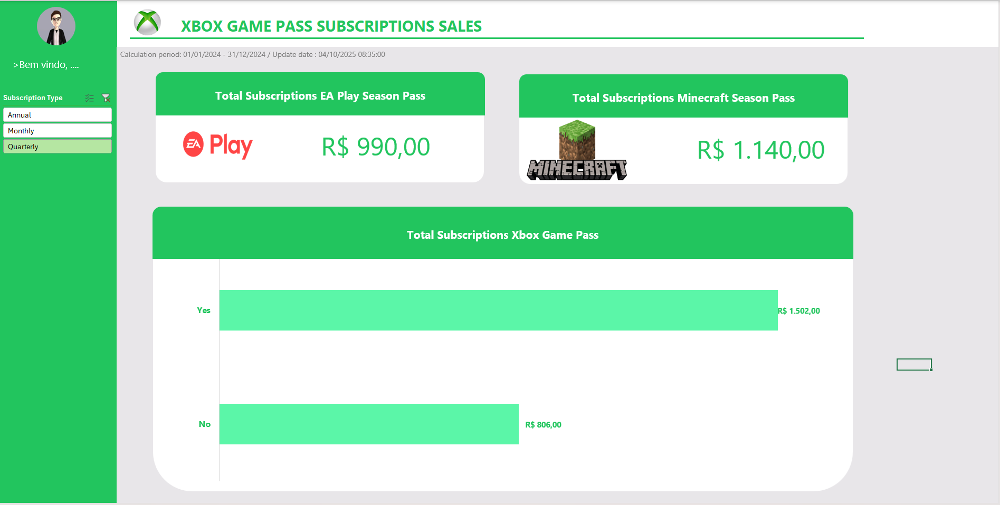

# 📊 Xbox Game Pass Subscriptions Sales Dashboard

Este projeto consiste em um **dashboard interativo desenvolvido no Excel**, com o objetivo de acompanhar as vendas de assinaturas relacionadas ao **Xbox Game Pass**, bem como aos passes de temporada **EA Play** e **Minecraft**.

---

## 🚀 Objetivo do Projeto
Fornecer uma visão clara e rápida sobre:
- Receita total de assinaturas EA Play e Minecraft;
- Receita total segmentada das assinaturas do **Xbox Game Pass**;
- Análise das assinaturas em diferentes modalidades (anual, mensal, trimestral).

---

## 📂 Estrutura do Arquivo
O arquivo do Excel foi construído com base em **quatro abas principais**:

1. **Assets**  
   Contém os elementos visuais (logos, ícones, imagens) utilizados no dashboard.

2. **Bases**  
   Armazena os **dados brutos** das assinaturas, incluindo:
   - Tipo de assinatura (Anual, Mensal, Trimestral);
   - Valor da assinatura;
   - Produto (EA Play, Minecraft, Xbox Game Pass).

3. **Cálculos**  
   Nesta aba foram criadas **tabelas dinâmicas** para:
   - Consolidação dos valores de vendas;
   - Segmentação por tipo de assinatura;
   - Comparação entre os diferentes produtos.

4. **Dashboard**  
   Página final de visualização, que utiliza os resultados da aba **Cálculos** para apresentar:
   - Indicadores em cards de resumo;
   - Gráficos de barras comparativos;
   - Layout interativo para seleção de filtros (ex.: tipo de assinatura).

---

## 📊 Exemplo de Visualização
O dashboard apresenta indicadores como:

- **Total Subscriptions EA Play Season Pass** → R$ 990,00  
- **Total Subscriptions Minecraft Season Pass** → R$ 1.140,00  
- **Total Subscriptions Xbox Game Pass** → Comparativo (Sim/Não) com valores de R$ 1.502,00 e R$ 806,00.  

---

## 🔧 Tecnologias Utilizadas
- **Microsoft Excel** (construção principal);
- **Tabelas Dinâmicas** (cálculos automáticos e consolidação);
- **Gráficos e Formatação** (visualização e estética do dashboard).

---

## 📝 Instruções de Reprodução
1. Abra o arquivo Excel do projeto.  
2. Insira ou atualize os dados na aba **Bases**.  
3. Atualize as **Tabelas Dinâmicas** na aba **Cálculos**.  
4. Navegue até a aba **Dashboard** para visualizar os resultados consolidados.  
5. Utilize os filtros de **Tipo de Assinatura** (Anual, Mensal, Trimestral) para explorar diferentes cenários.

---

## 📌 Observações
- O período de cálculo considerado neste exemplo vai de **01/01/2024 a 31/12/2024**.  
- A última atualização de dados foi feita em **04/10/2025 às 08:35**.  

---

👨‍💻 **Autor:** [Jorge Ferreira]  
📅 **Data:** Outubro/2025  
